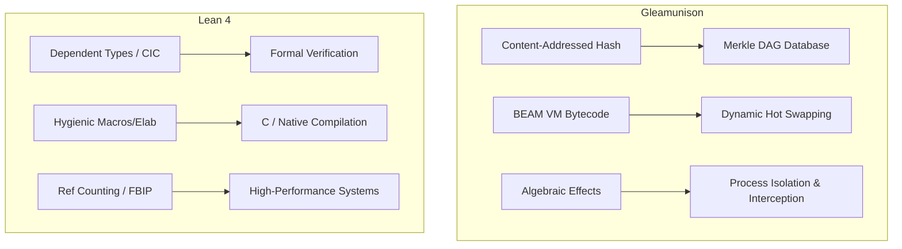

# Rich Hickey Gap Analysis: gleamunison vs. Lean Lang (Lean 4)

This document performs a thorough, multi-dimensional **Rich Hickey Gap Analysis** evaluating the architectural design, feature sets, runtime behavior, and typing paradigms of **gleamunison** (v3.4.0, a content-addressed algebraic effects runtime on the BEAM) and **Lean 4** (the interactive theorem prover and general-purpose systems programming language).

---

## 1. Core Architectural Philosophies

The two systems are built on diametrically opposed, yet highly structured, foundational constraints. To perform a true "de-complection" (the separation of orthogonal concerns), we must first identify what each language complects and what it isolates.



### Gleamunison: The Distributed Runtime Constraint
*   **De-complects Name from Identity**: A function's name is completely decoupled from its behavior and structural lookup. Code is identified solely by the cryptographic hash of its Abstract Syntax Tree (AST) and inferred type.
*   **De-complects Logic from Capability**: Side effects are decoupled from term execution using **Algebraic Effects**. Functions specify *what* they need to do at a high level (e.g., `Read`, `Write`), and the calling host handles *how* it runs using stack-mounted handler closures.
*   **BEAM VM Concurrency**: Leverages process-level sandboxing, dynamic module loading, and lightweight Erlang actor scheduling.

### Lean Lang (Lean 4): The Mathematical Verification Constraint
*   **De-complects Implementation from Soundness**: Lean is built on the **Calculus of Inductive Constructions (CIC)** with dependent types. A program is simultaneously an executable computation and a mathematical proof of its own correctness.
*   **Self-Hosted Extensibility**: The compiler is written in Lean itself, exposing its parsing, elaboration, and syntax-tree processing pipelines to the user. Metaprogramming is a first-class citizen.
*   **Native Systems Execution**: Lean compiles directly to C (and LLVM), managing memory via optimized **Reference Counting** with **Functional But In-Place (FBIP)** updates, completely bypassing virtual machines or tracing garbage collectors.

---

## 2. Feature Set Comparison

| Capability Area | Lean 4 (v4.x) | gleamunison (v3.4.0) | Unison (v1.x) |
| :--- | :--- | :--- | :--- |
| **Code Identity** | Module paths, namespaces, and standard import files. | Cryptographic SHA256 hashes of terms + canonical inferred types. | Cryptographic SHA3-512 hashes of terms + internal type structures. |
| **Type System** | Dependent Types (Calculus of Inductive Constructions) with universe polymorphism. | Hindley-Milner Type Inference (Int, Float, Text, List, Lambda, Custom Types). | Hindley-Milner Type Inference (with structural type guidances). |
| **Effect Model** | Monads (e.g., `IO`, `State`, `Reader`) and Monad Transformers with auto-lifting. | Implicit stack-based algebraic effects (positional operations, dynamic handlers). | Explicit algebraic effects (continuation `k` as a pattern-matchable variable). |
| **Runtime Target** | Native machine code (via C compilation and LLVM). | Erlang VM (BEAM) bytecode, loaded dynamically at runtime. | Unison Runtime (M2 interpreter) / Scheme native compilation. |
| **Memory Management** | Reference counting with **Functional But In-Place (FBIP)** destructive updates. | BEAM tracing garbage collector (segmented heap per isolated process). | Native runtime garbage collection (Scheme GC / VM GC). |
| **Code Synchronization** | Lake package manager pulling Git repositories; re-compilation required. | Merkle DAG pull sync over Erlang distribution (dynamic bytecode transfer). | Merkle DAG pull sync over HTTP/IPFS. |
| **Upgrade Mechanism** | Static linking; requires process termination and redeployment. | **Dynamic code loading** (`code:load_binary/3`) and instant actor hot-upgrades. | Dynamic code updates within the UCM session context. |
| **Metaprogramming** | Extensible parser, hygienic macro system, and syntax elaborators. | Fixed S-Expression parser and surface-to-core elaborator. | Syntax macros and AST processing inside the codebase manager. |
| **Verifiability** | Interactive theorem proving via tactics, proof objects, and SAT solvers. | Run-time linearity enforcement for single-shot continuations. | Type-level purity guarantees. |

---

## 3. In-Depth Feature Difference Analysis

### 3.1. Code Identity: Module Namespaces vs. Merkle DAGs
*   **Lean 4**: Relies on traditional files, directories, and package manifests. If a library updates a function in a Git repository, all dependent modules must be recompiled. Dependency conflicts (e.g., Diamond Dependency) are resolved at the build-tool layer (`lake`).
*   **gleamunison**: Eliminates build-tool dependency resolution. Code is represented as a content-addressed database (stored in DETS/ETS). Different versions of the same function can coexist in the runtime simultaneously under different hash-named modules (e.g., `m_a1b2c3d4...`). Diamond dependencies are structurally impossible.

### 3.2. Type System: Dependent Types vs. Hindley-Milner
*   **Lean 4**: A program can encode complex mathematical invariants in its types. For example, a lookup function can require a proof that the index is within bounds: `def get (a : Array α) (i : Nat) (h : i < a.size) : α`. The type checker verifies these proofs at compile-time.
*   **gleamunison**: Uses a decidable Hindley-Milner type system. It compiles terms efficiently and infers types without requiring manual proofs. While it cannot prove arbitrary mathematical properties, it guarantees standard type safety (no runtime type mismatches) with zero developer overhead.

### 3.3. Effect Model: Monads vs. Algebraic Effects
*   **Lean 4**: Side effects must be explicitly tracked using monads. Writing complex programs requires stacking monads (`ReaderT`, `StateT`, `ExceptT`), which introduces the "monad transformer stack" problem. Although Lean 4 uses auto-lifting to simplify this, developers still write code bound to a specific monadic structure.
*   **gleamunison**: Algebraic effects decouple the program logic from the execution environment. The function specifies `ability Read`, and the caller provides the handler. The handler stack is maintained in the process dictionary, making the syntax look entirely pure and avoiding monad lifting.

```gleam
// gleamunison: Implicitly requests the ability. Pure syntax.
fn process_file() -> Text {
  let content = do_read("config.json")
  content
}

// Lean 4: Explicitly bound to the IO monad.
def processFile : IO String := do
  let content ← IO.FS.readFile "config.json"
  pure content
```

### 3.4. Runtime Execution: Native C & FBIP vs. BEAM VM
*   **Lean 4**: Focuses on raw systems performance. Instead of a GC, Lean 4 uses reference counting. If a data structure's reference count is exactly 1, the runtime performs a **destructive (in-place) update** instead of allocating new memory. This allows pure functional code to execute as fast as imperative C code.
*   **gleamunison**: Focuses on Concurrency and reliability. By compiling to BEAM bytecode, it gains access to preemptive scheduling, isolated heaps per actor (which makes GC pauses negligible), and the ability to load new code into a running VM without stopping it.

---

## 4. Benefits and Trade-offs

### Dependent Types (Lean 4)
*   **Benefits**: Unparalleled correctness guarantees. Eliminates entire classes of logic bugs. Permits formal proof verification of critical systems (e.g., smart contracts, kernel drivers).
*   **Trade-offs**: Extreme cognitive overhead. Compile times can be long because the compiler is searching for proofs. Typing annotations often exceed the length of the program logic.

### Content-Addressed Codebase (gleamunison)
*   **Benefits**: Zero-configuration synchronization, zero dependency conflicts, and native support for distributed code shipping and dynamic continuations.
*   **Trade-offs**: Indirection in naming. Developers cannot simply read a stack trace without a name-resolver that maps hash-named modules (`m_hash`) back to human-readable names.

### Functional But In-Place (FBIP) Memory Optimization (Lean 4)
*   **Benefits**: Predictable performance with minimal memory overhead. Avoids tracing GC sweeps, making it suitable for real-time systems.
*   **Trade-offs**: Complex compiler analysis. The compiler must track reference-counting points and perform alias analysis, which increases compiler complexity.

### Dynamic Code Loading on the BEAM (gleamunison)
*   **Benefits**: Highly resilient. A system can be patched, upgraded, or scaled horizontally while handle connections remain active.
*   **Trade-offs**: Reliance on the BEAM VM. The target platform is limited to systems where the Erlang runtime is installed, whereas Lean 4 can run on bare-metal systems.

---

## 5. Complexity vs. Utility Matrix

This matrix evaluates potential features of Lean 4 that could be adapted into the `gleamunison` runtime:

| Feature to Adapt | Utility (1-10) | Complexity (1-10) | Weighted Power / Complexity | Recommendation |
| :--- | :---: | :---: | :---: | :--- |
| **Monadic syntax bindings (`do` sugar)** | 7 | 2 | **3.50** | **Adopt**: Allows sequencing computations with custom monad-like structures in S-expressions. |
| **Hygienic Macro System** | 8 | 7 | **1.14** | **Defer**: Extremely useful for custom DSLs, but high complexity in a content-addressed system where macros must be hashed deterministically. |
| **Dependent Types** | 10 | 10 | **1.00** | **Reject**: Over-complects the prototype. Hindley-Milner is sufficient for runtime-driven hot upgrades. |
| **FBIP-style Compiler Optimizations** | 9 | 9 | **1.00** | **Reject**: The BEAM VM manages memory via process-isolated tracing GC; introducing reference-counting optimization violates BEAM memory constraints. |
| **Syntax Extensions / Custom Grammars** | 6 | 7 | **0.86** | **Reject**: Keeping the S-Expression grammar static ensures parsing and hashing remain fast and predictable. |

---

## 6. Actionable Recommendations

Based on the Rich Hickey gap analysis, we recommend the following evolutionary paths for `gleamunison`:

### 1. Reject Dependent Types (Keep Decidable Hindley-Milner)
The primary value proposition of `gleamunison` is the intersection of **content-addressing, algebraic effects, and BEAM hot-upgrades**. Adding dependent types would require writing proof search systems inside the Gleam compiler, greatly increasing complexity without helping the core distributed-compute objectives.

### 2. Implement Monadic Syntactic Bindings in S-expressions
Lean 4 uses clean `do` blocks to sequence monadic operations. We should introduce `let*` or `do` binding syntax in our S-expression elaborator (`elaborate.gleam`) to allow developers to chain effectful computations smoothly without nesting deep callbacks.

```lisp
;; Proposed S-Expression improvement:
(do
  (let* [user (Console.read_line)]
        [auth (Auth.check user)]
        (Console.print auth)))
```

### 3. Maintain Decoupled Sandboxing (Reject FBIP)
Because `gleamunison` runs on the BEAM, we must rely on Erlang's native GC. Attempting to optimize memory allocations via RC/FBIP would require bypassing the BEAM heap, which would break the process boundaries that provide our secure sandboxing.
